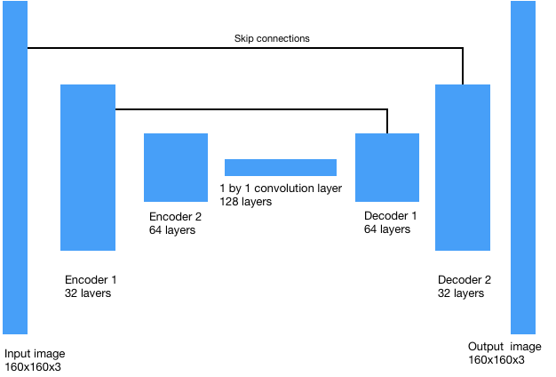

## Deep Learning Project <!-- omit in toc -->
In this project, I trained a deep neural network to identify and track a target in simulation. THe so-called “follow me” applications like this are key to many fields of robotics and the very same techniques may be extended to scenarios like advanced cruise control in autonomous vehicles or human-robot collaboration in industry.

The model used in the semantic segmentation task is a 7-layer fully convolutional network (FCN), built in Tensorflow and Keras. The model training was accelerated with a p2.xlarge AWS EC2 instance.

I will walk through architecture of the constructed model, followed by training, results and thoughts on further improvement.

## Neural network architecture <!-- omit in toc -->
A fully convolutional network (FCN) is an DNN model for end-to-end, pixels-to-pixels semantic segmentation. Unlikely Convolutional Neural Network (CNN), FCN is composed of convolutional layers without fully-connected layers found at the end of the network. By changing the "connected" to "convolutional", one perserve the spatial information through the entire network. A typical FCN is consisted of encoder, 1 by 1 convolution layer, decoder, and some skip connections. 

#### Encoder.
The encoder layers the model to gain a better understanding of the characeristics in the image, building a depth of understanding with respect to specific features and thus the 'semantics' of the segmentation. The first layer might discern colours and brightness, the next might discern aspects of the shape of the object, so for a human body, arms and legs and heads might begin to become successfully segmented. Each successive layers builds greater depth of semantics necessary for the segmentation. However, the deeper the network, the more computationally intensive it becomes to train.

There are two layers of encoders in the current model. The first layer uses a filter size of 32 and a stride of 2, while the second convolution uses a filter size of 64 and a stride of 2. Both convolutions used same padding. The padding in conjunction with a stride of 2 half image size in each layer, while setting the depth to the filter size. The python code is shown below:

 -
 ```python
    l1 = encoder_block(inputs, 32, 2)
    l2 = encoder_block(l1,64,2)
    # Remember that with each encoder layer, the depth of your model (the number of filters) increases.
    ```
- 1 by 1 convolution layer.
The 1x1 convolution layer is a regular convolution, with a stride of 1. This layer flattens the data for classification while retaining their spatial information. In the pythong below, we use depth of 128 for this layer:

    ```python
    l3 = conv2d_batchnorm(l2, 128, kernel_size=1, strides=1) #Add 1x1 Convolution layer using conv2d_batchnorm().
    ```
- decoder
    ```python
    l4 = decoder_block(l3,l1,64)
    x = decoder_block(l4,inputs,32) # Add the same number of Decoder Blocks as the number of Encoder Blocks
    ```
- skip connections

Skip connections allow the network to retain information from prior layers that were lost in subsequent convolution layers. Skip layers use the output of one layer as the input to another layer. By using information from multiple image sizes, the model retains more information through the layers and is therefore able to make more precise segmentation decisions.




## Training parameters <!-- omit in toc -->

The below parameters were attempted to train the fully-connected network, yielding satisfactory results:

- learning_rate = 0.001
- batch_size = 128
- num_epochs = 40
- steps_per_epoch = 200
- validation_steps = 50
- workers = 2

A more adaptive approach may be adopted to dynamically tune learning_rate as a function of validation loss. 

Training took place on an Amazon EC2 ([p2.xlarge](https://aws.amazon.com/ec2/instance-types/p2/)) instance. Each epoch takes about 320 seconds to train, and the total used time amounted to 3.5 hours.

## Results <!-- omit in toc -->

The IoU is 0.55, while the final weighted score is 0.407.

## Thoughts on further improvement <!-- omit in toc -->
